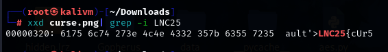
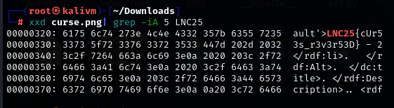

# cursed

## Challenge description

### You've been hexed! Can you REVERSE the clues to REVERSE the curse?

For this challenge, we are given a PNG file

The challenge description mentions hex, which could mean that we need to perform a hex dump

Since the flag format is LNC25{flag}, I used the following command to perform a hex dump and used **grep** to find all instances of LNC25

```
xxd curse.png | grep -i LNC25
```




Then I used the following command to show the next 5 lines as well to get the flag

```
xxd curse.png | grep -iA 5 LNC25
```




## Flag
```
LNC25{cUr53s_r3v3r53D}
```