# Lexington Infomatics Tournament CTF 2025 Writeup

NOTICE! This writeup was originally published on Medium. I suggest you read that version. It looks better imo.

Medium writeup: [Link to article](https://medium.com/@enderSSSSS/lexington-infomatics-tournament-ctf-2025-writeup-0e3821dd1da9)


I had heard this CTF was supposed to include forensic challenges but there were none. Though I was pretty disappointed, it forced me to focus on the other categories which actually allowed me to learn some new things and solve some of the misc and web challenges.

# Misc
geoguessr1

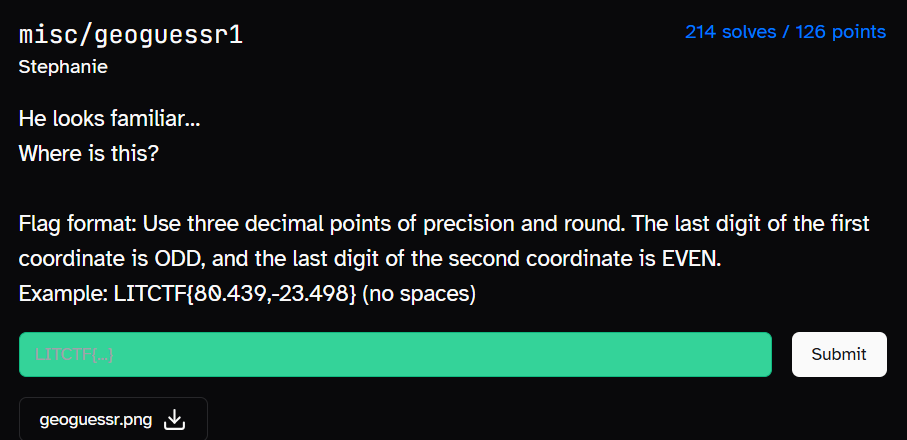


For this challenge, we are given an image of a green statue.


Through reverse image search, I found the statue to be the Minuteman Statue on Lexington.


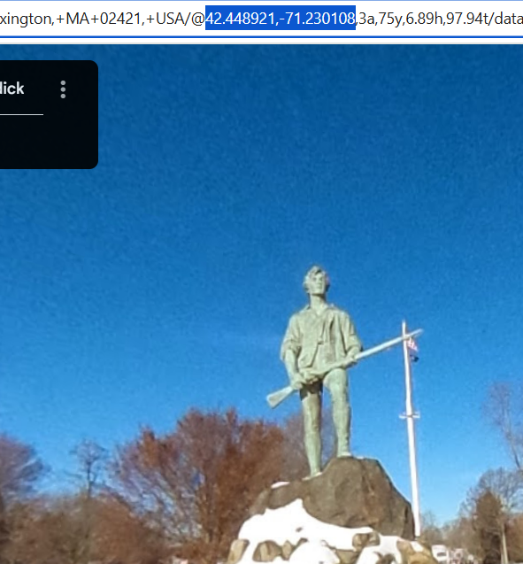

All we need to do now is search “Minuteman Statue on Lexington” on Google Maps and go to the street view.

Rounding the coordinates up to 3 decimal places, we get our flag

```
LITCTF{42.449,-71.230}
```

geoguessr3

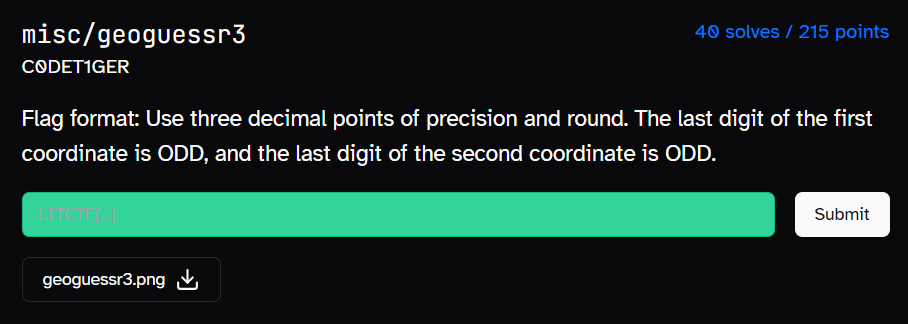


This is the image we are given.

This one took me quite a while. At first, I tried typing the name of the business on the right to the best of my ability and found it to be Caisse d’Epargne.

I then went through each Caisse d’Epargne branch in Google maps trying to find one that had the red object around the the door.

After some (long) time, I decided to reverse image search the distributed image with the keyword ‘france’ with my new knowledge of it being a French brand.

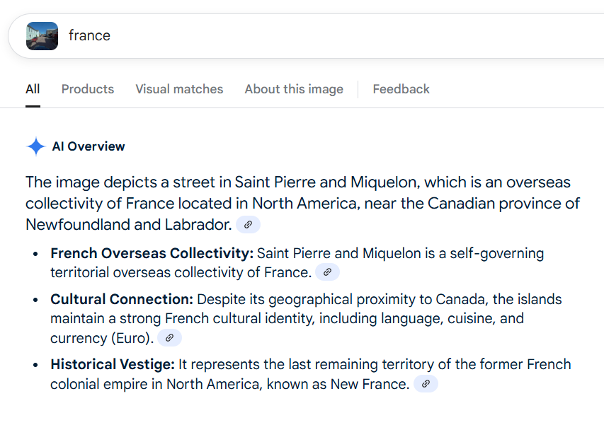

This narrowed the location of the Caisse d’Epargne branch down to Saint Pierre and Miquelon. Hence, my search queries in Google Maps were now “Caisse d’Epargne Saint Pierre” and “Caisse d’Epargne Miquelon”.


In one entry for Caisse d’Epargne Miquelon, I saw the matching yellow house with the red stairwell.

Navigating backwards, we find the exact Caisse d’Epargne branch and pinpoint the coordinates the photo was taken.

Rounding the coordinates up to 3 decimal places, we get our flag.

```
LITCTF{46.781,-56.171}
```

exif

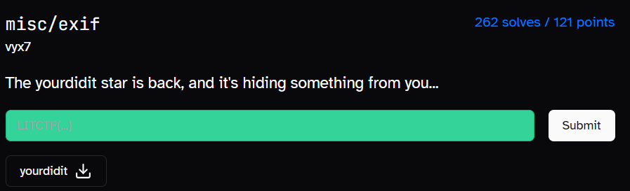

With the name exif, I thought the flag would show up directly in exiftool’s output. I was wrong.

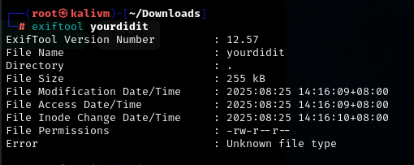

However, there was an interesting metadata tag, Error mentioning that the yourdidit file type was unknown.

```
xxd yourdidit | head
```

So, I used xxd in an attempt to get the file header and identify its file type.

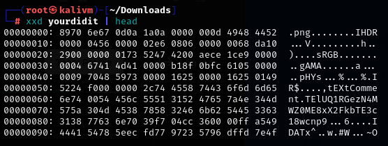

I found that it was a PNG but I also saw something interesting, which would be tExtComment.TElUQ1RGezN4MWZ0ME8xX2FkbTE3c18wcnp9. This appeared to be some form of encoded data.

Hence, I headed to CyberChef and tried my luck with base64.

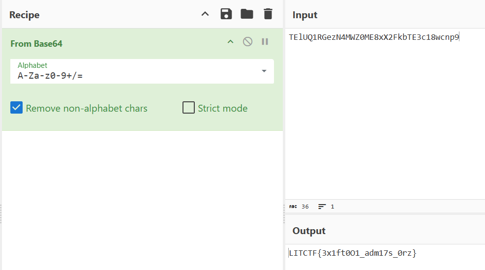

And with that, we get the flag.

```
LITCTF{3x1ft0O1_adm17s_0rz}
```

flag printer revisited

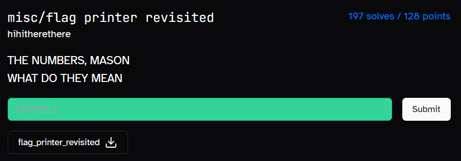

For this challenge, we are given a file with G-code. Since the topic of G-code was new to me, I used the below Google Dork query to find CTF writeups talking about G-code.

```
site:medium.com "gcode" "CTF"
```

Reading some of the writeups, I found out that G-code was used for 3D printing and would likely need the code to run to generate the flag.

Hence, I searched for “online gcode simulator” and landed on this website https://ncviewer.com/

Dumping the contents of the file, clicking on the PLOT button and zooming out, I see something where I can vaguely make out a flag.

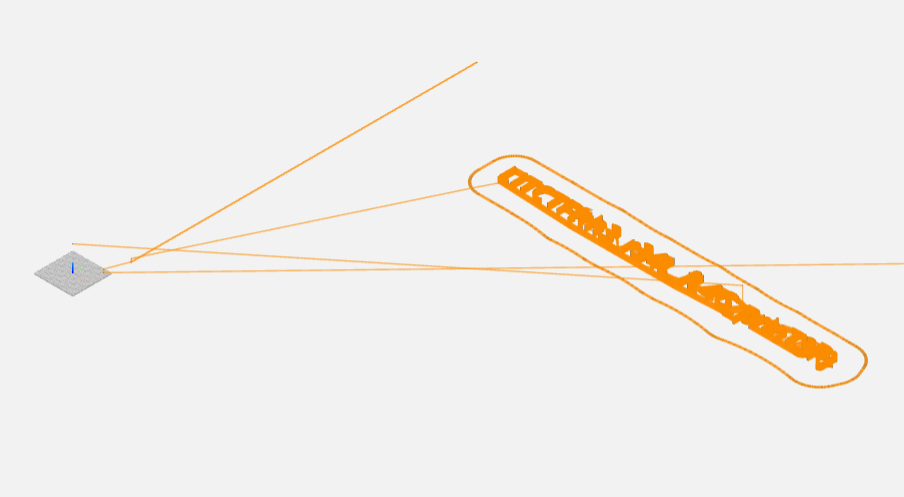

So I zoomed in to that object and noted down the flag as I went through it.

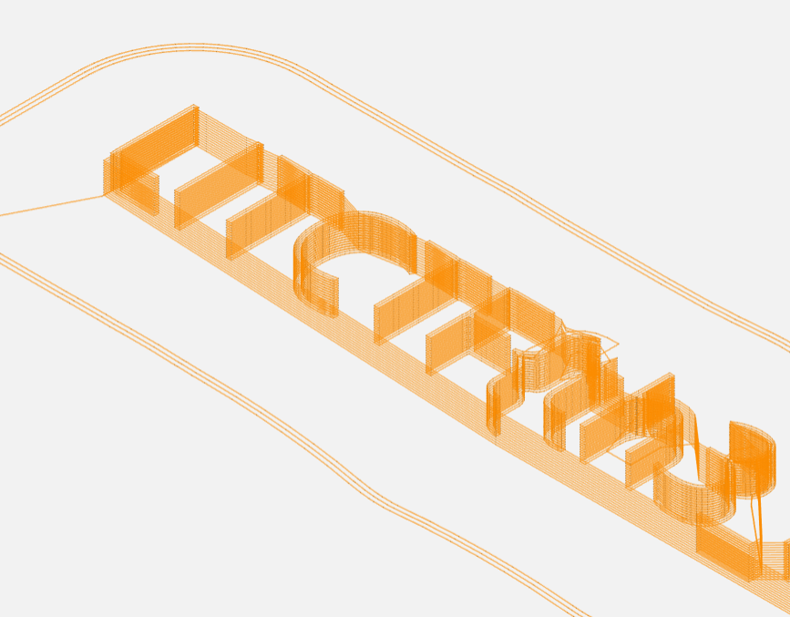

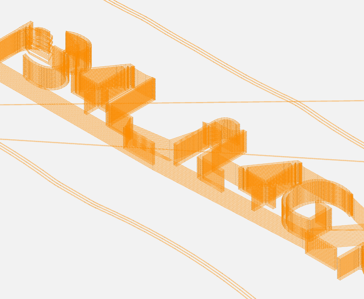

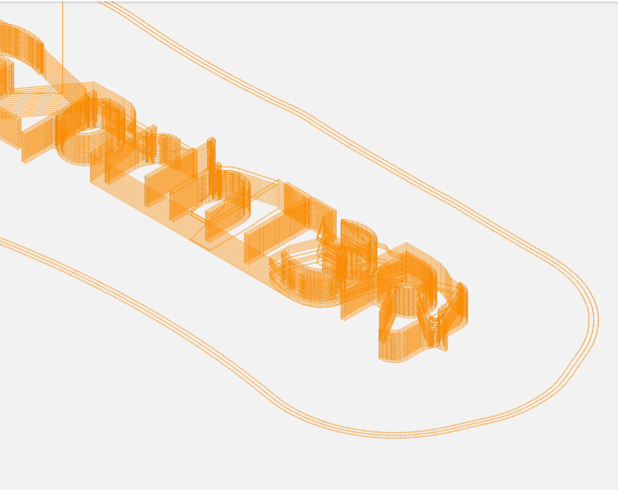

Piecing each part together, we get our flag.

```
LITCTF{th3_r34L_fL4G_prinT3R}
```

[name]

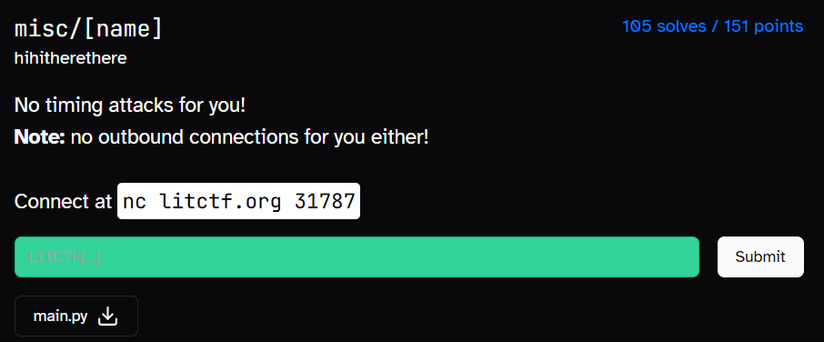

For this challenge, we are given a vulnerable server that executes the input in eval. However, standard output and standard error are redirected to /dev/null silencing the program’s output

I tried different payloads before finally finding one that worked. The payload is as follows.

```
__import__('os').system("cat flag.txt")
```

This payload worked as it creates a child process and reads flag.txt, sending the output straight to terminal.

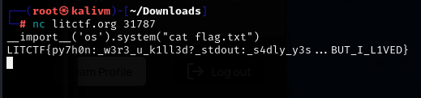

Hence, our flag is

```
LITCTF{py7h0n:_w3r3_u_k1ll3d?_stdout:_s4dly_y3s…BUT_I_L1VED}
```

# Web
LexMACS' Secret

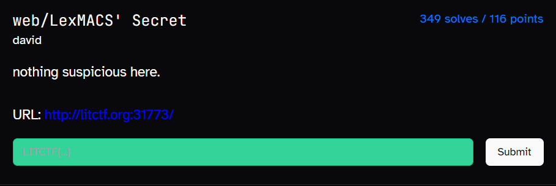

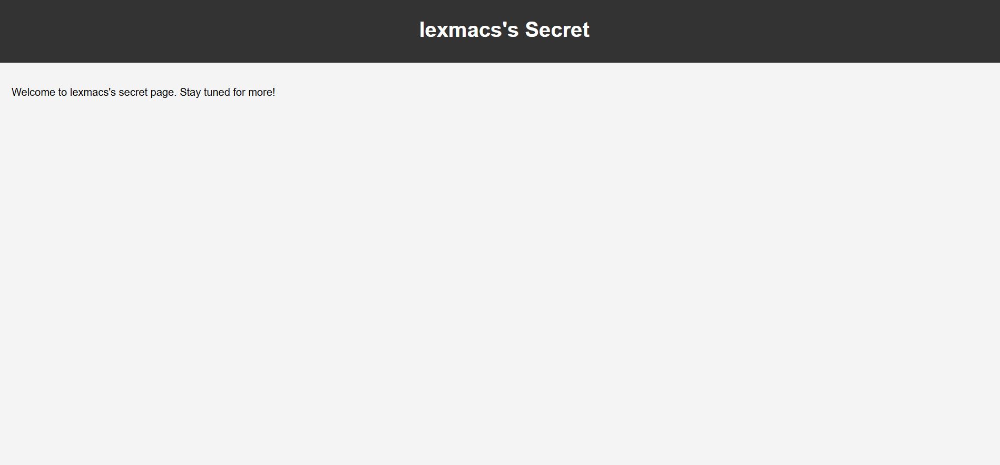

This is what the website looks like.

```
<div><div><div><div>L<div><div><div><div>I<div><div><div><div>T<div><div><div><div>C<div><div><div><div>T<div><div><div><div>F<div><div><div><div>{<div><div><div><div>S<div><div><div><div>e<div><div><div><div>C<div><div><div><div>R<div><div><div><div>3<div><div><div><div>t<div><div><div><div>_<div><div><div><div>h<div><div><div><div>A<div><div><div><div>s<div><div><div><div>-<div><div><div><div>B<div><div><div><div>3<div><div><div><div>e<div><div><div><div>n<div><div><div><div>-<div><div><div><div>l<div><div><div><div>E<div><div><div><div>4<div><div><div><div>K<div><div><div><div>d<div><div><div><div>}</div></div></div></div></div></div></div></div></div></div></div></div></div></div></div></div></div></div></div></div></div></div></div></div></div></div></div></div></div></div></div></div></div></div></div></div></div></div></div></div></div></div></div></div></div></div></div></div></div></div></div></div></div></div></div></div></div></div></div></div></div></div></div></div></div></div></div></div></div></div></div></div></div></div></div></div></div></div></div></div></div></div></div></div></div></div></div></div></div></div></div></div></div></div></div></div></div></div></div></div></div></div></div></div></div></div></div></div></div></div></div></div></div></div></div></div>
```

Looking at the source code, we see a weird chunk of div tags.

Looking closer, we can see the flag is broken into parts and hidden among the div tags.

So I wrote a Python script to remove the html using BeautifulSoup and get the flag.

```
from bs4 import BeautifulSoup

string = "<div><div><div><div>L<div><div><div><div>I<div><div><div><div>T<div><div><div><div>C<div><div><div><div>T<div><div><div><div>F<div><div><div><div>{<div><div><div><div>S<div><div><div><div>e<div><div><div><div>C<div><div><div><div>R<div><div><div><div>3<div><div><div><div>t<div><div><div><div>_<div><div><div><div>h<div><div><div><div>A<div><div><div><div>s<div><div><div><div>-<div><div><div><div>B<div><div><div><div>3<div><div><div><div>e<div><div><div><div>n<div><div><div><div>-<div><div><div><div>l<div><div><div><div>E<div><div><div><div>4<div><div><div><div>K<div><div><div><div>d<div><div><div><div>}</div></div></div></div></div></div></div></div></div></div></div></div></div></div></div></div></div></div></div></div></div></div></div></div></div></div></div></div></div></div></div></div></div></div></div></div></div></div></div></div></div></div></div></div></div></div></div></div></div></div></div></div></div></div></div></div></div></div></div></div></div></div></div></div></div></div></div></div></div></div></div></div></div></div></div></div></div></div></div></div></div></div></div></div></div></div></div></div></div></div></div></div></div></div></div></div></div></div></div></div></div></div></div></div></div></div></div></div></div></div></div></div></div></div></div></div></body>"

soup = BeautifulSoup(string, "html.parser")

flag = ''.join(soup.stripped_strings)

print(flag)
```

```
LITCTF{SeCR3t_hAs-B3en-lE4Kd}
```

file viewer 1

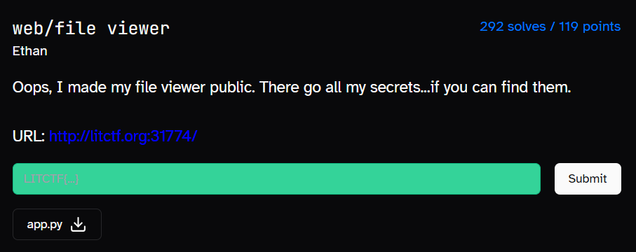

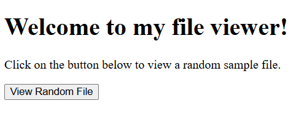

This website is a random file viewer

Clicking the button, I get redirected to the page below

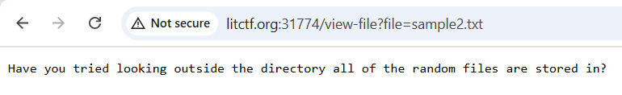

Looking at the URL, my mind immediately went: “LFI”! I immediately tried testing my theory by seeing if I was able to access /etc/passwd.

Going to the URL below made me download the passwd file.

```
http://litctf.org:31774/view-file?file=../../../../etc/passwd
```

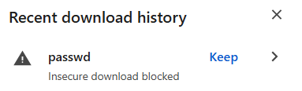

I then thought replacing /etc/passwd with /flag.txt would lead me to the flag. However, that was not the case. Sample3.txt had mentioned that there was 3 sample files.

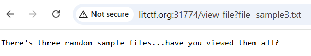

I went to sample1.txt and sample2.txt and saw that sample2.txt was perhaps hinting at going one folder up.

Hence, I typed the URL below and got the flag

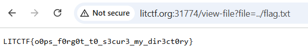

```
LITCTF{o0ps_f0rg0t_t0_s3cur3_my_dir3ct0ry}
```

file viewer 2

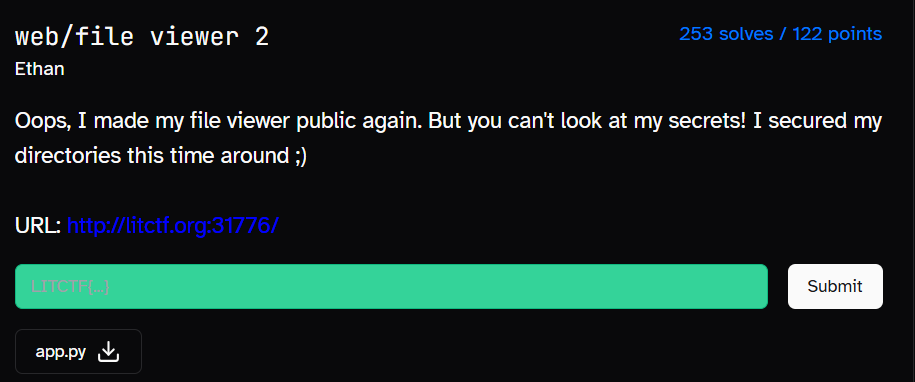

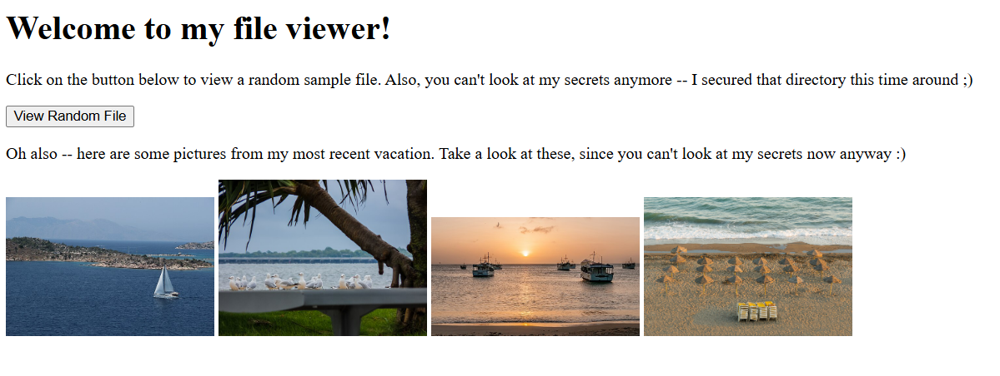

This is what the website looks like now

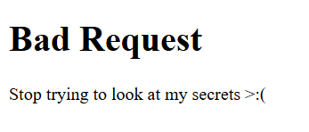

When trying to access /etc/passwd, this shows up.

Alright, so clearly there are some filters put in place now.

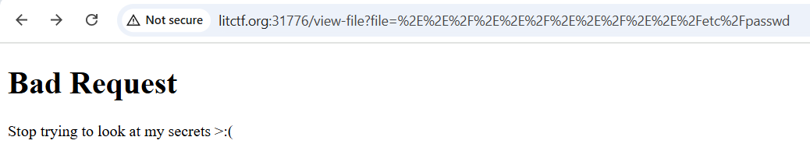

I tried to use URL encoding to bypass the filter.

But that too didn’t work.

Doing some research on ways to bypass LFI filters, I found that adding ./ in front of the original payload worked. Hence, the final URL is

```
http://litctf.org:31776/view-file?file=./../flag.txt
```

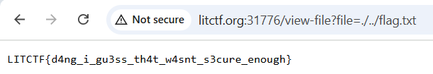

```
LITCTF{d4ng_i_gu3ss_th4t_w4snt_s3cure_enough}
```

tabled

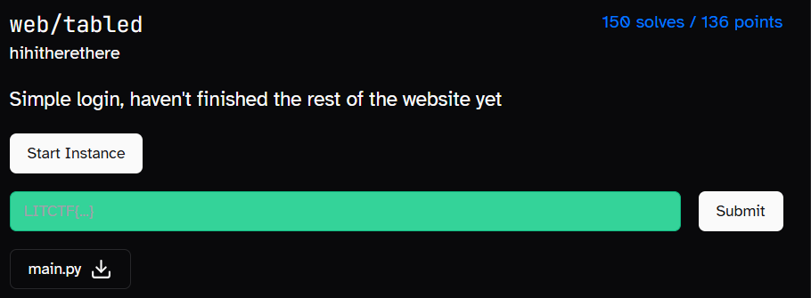

Reading main.py, I see that the website is vulnerable to SQL injection.

I tried the usual ‘ OR 1=1 — but to no avail.

Reading main.py again, I saw that the name of the table is random each instance and thought that the intended solution was to directly query the flag from the table.

But to do that, I would first need the table’s name.

```
' UNION SELECT name FROM sqlite_master--
```

Hence, I used the above payload in the username field to find the name of the table.

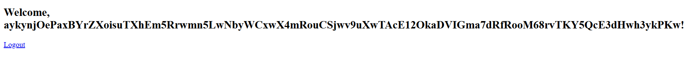

Clicking on the login button redirects me to the /home endpoint where the table name is displayed.

```
' UNION SELECT flag FROM aykynjOePaxBYrZXoisuTXhEm5Rrwmn5LwNbyWCxwX4mRouCSjwv9uXwTAcE12OkaDVIGma7dRfRooM68rvTKY5QcE3dHwh3ykPKw--
```

With new knowledge of the table name, I headed back to the login page and used the above payload in the username field to extract the flag.

Hence, we get our flag.

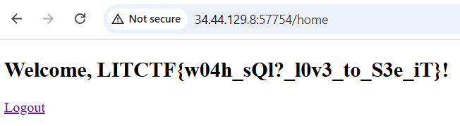

```
LITCTF{w04h_sQl?_l0v3_to_S3e_iT}
```

# Reverse
LIT Newsapp

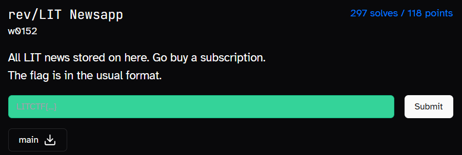

Knowing that the flag format was LITCTF{}, I first tried my luck with strings, using grep to look for any output that includes LIT.

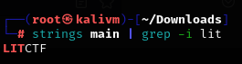

Seeing LITCTF show up, I then tweaked the above command to also display the 5 lines below LITCTF.

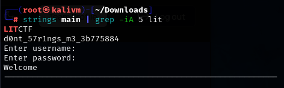

```
LITCTF{d0nt_57r1ngs_m3_3b775884}
```

# Crypto
one hint

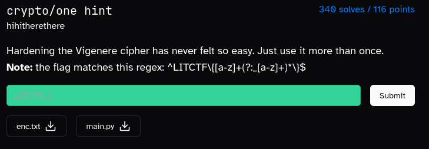

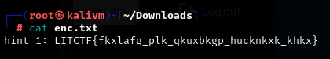

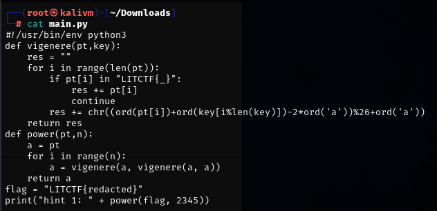

Looking at main.py, I see that the script applies double Vigenère encryption using a key derived from the plaintext flag on itself 2345 times.

However, the function used to encrypt the flag is cyclic so I could write a script that encrypts the flag repeatedly until it becomes a readable flag.

```
def vigenere(pt,key):
    res = ""
    for i in range(len(pt)):
        if pt[i] in "LITCTF{_}":
            res += pt[i]
            continue
        res += chr((ord(pt[i]) + ord(key[i % len(key)]) - 2*ord('a')) % 26 + ord('a'))
    return res

def power_once(pt):
    key = vigenere(pt, pt)
    return vigenere(pt, key)

hint = "LITCTF{fkxlafg_plk_qkuxbkgp_hucknkxk_khkx}"

a = hint
for i in range(1, 50000):   
    a = power_once(a)
    if a.startswith("LITCTF{") and a.endswith("}"):
        print(f"[+] Found candidate after {i} steps:\n{a}")
        break
```

Running the script, we get the flag.

```
LITCTF{perhaps_the_weirdest_vigenere_ever}
```

# Conclusion
In conclusion, I had a lot of fun playing this CTF and I learnt a lot of things while also sharpening my skills. I look forward to LIT CTF next year, where there could hopefully be some forensics challenges. lol