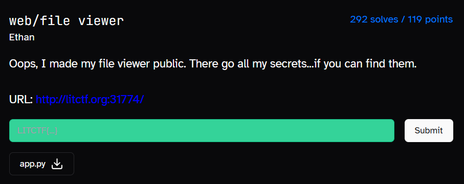
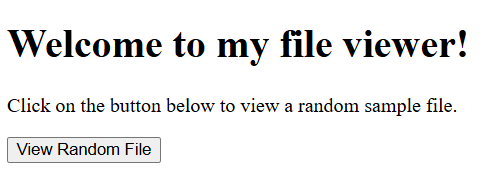
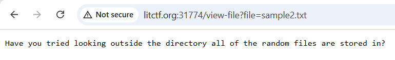
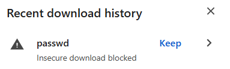
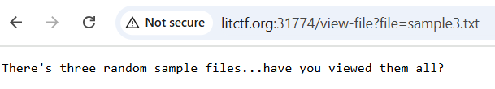
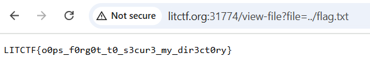

# file viewer 1



Description for file viewer




This website is a random file viewer

Clicking the button, I get redirected to the page below



Looking at the URL, my mind immediately went: “LFI”! I immediately tried testing my theory by seeing if I was able to access /etc/passwd.

Going to the URL below made me download the passwd file.

```
http://litctf.org:31774/view-file?file=../../../../etc/passwd
```



I then thought replacing /etc/passwd with /flag.txt would lead me to the flag. However, that was not the case. Sample3.txt had mentioned that there was 3 sample files.



I went to sample1.txt and sample2.txt and saw that sample2.txt was perhaps hinting at going one folder up.

Hence, I typed the URL below and got the flag



```
LITCTF{o0ps_f0rg0t_t0_s3cur3_my_dir3ct0ry}
```