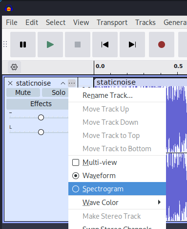

# Just Some Avocado

## Challenge description

For this challenge, we are given an image **avocado.jpg**


Binwalk reveals a zip file containing another zip file and a WAV (Waveform Audio File Format) file


We extract the zip file using the command **binwalk -e** and it creates a folder **_avocado.jpg.extracted**


We try to unzip the zip file but it is password-protected.


Here, we can try to brute force the password using John The Ripper (JTR).

First, we use **zip2john**

```
zip2john 188F7.zip > hash.txt
```


Then we use john to start the brute force, specifying rockyou.txt as the wordlist

```
john hash.txt --wordlist=/usr/share/wordlists/rockyou.txt
```

We successfully got the password: impassive3428


Trying to unzip justsomezip.zip, we find that it is password-protected as well!

However, john was not able to crack it


However, there was still hope as information could be hidden in the WAV file via steganography

There are some apps for this but I recommend Audacity or Sonic Visualizer

After opening the WAV file in Audacity, the password to justsomezip.zip can be seen by doing the following

Clicking on **...** > **Spectogram** as shown in the image below




## Before


## After


Now that we got the password, we can unzip the zip file


There, we get our flag


## Flag
```
scriptCTF{1_l0ve_d41_v3r0n}
```