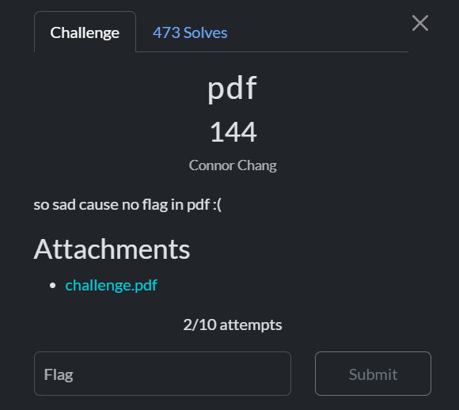
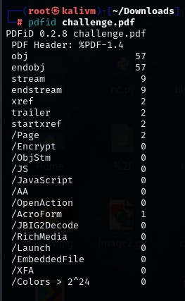
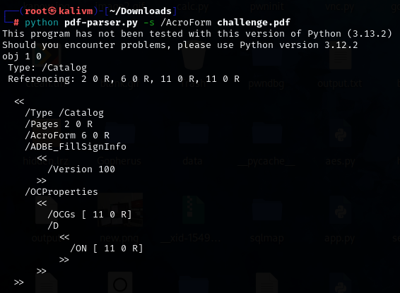
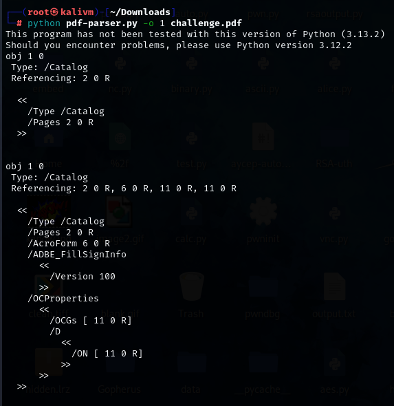
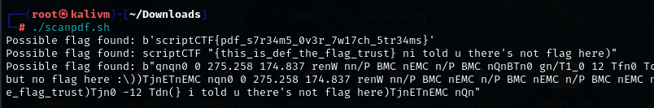

# pdf

## Challenge description

For this challenge, we are given a PDF file




My first thought was using pdfid to find if there are any files embedded in the PDF




I then used pdf parser, a tool by Didier Steven to explore PDF files.

First, I use the following command to find the target object being referenced by /AcroForm, which in this case is 6
```
python pdf-parser.py -s /AcroForm challenge.pdf
```



Next, I used the following command to inspect object 6
```
python pdf-parser.py -o 6 challenge.pdf
```




To no avail, the flag was not there


Doing some research, I found out that information could be hidden in the bytes of objects and could be revealed using the -f argument in pdf-parser

Hence, I created a bash script to go through each object in the PDF and flag out anything that contains **scriptCTF**

## Bash script
```
#!/bin/bash

PDF_FILE="challenge.pdf"

python pdf-parser.py -n "$PDF_FILE" | grep -i "obj " | awk '{print $2}' > num.txt

> output.txt

while read line; do
    echo "Read: $line" >> output.txt
    python pdf-parser.py -f -o $line "$PDF_FILE" >> output.txt
done < num.txt


while read lines; do
    if [[ "$lines" == *scriptCTF* ]]; then
        flag="$lines"
        echo "Possible flag found: $flag"
    fi
done < output.txt
```

Running the script, we get our flag



## Flag
```
scriptCTF{pdf_s7r34m5_0v3r_7w17ch_5tr34ms}
```